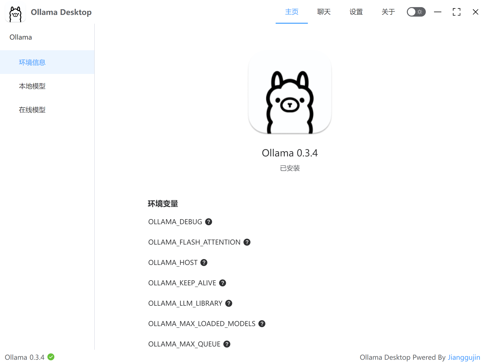
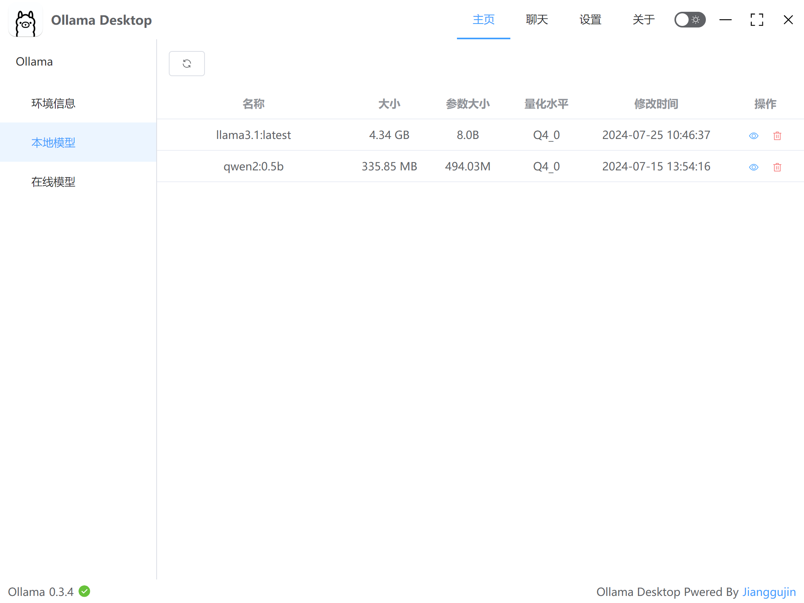
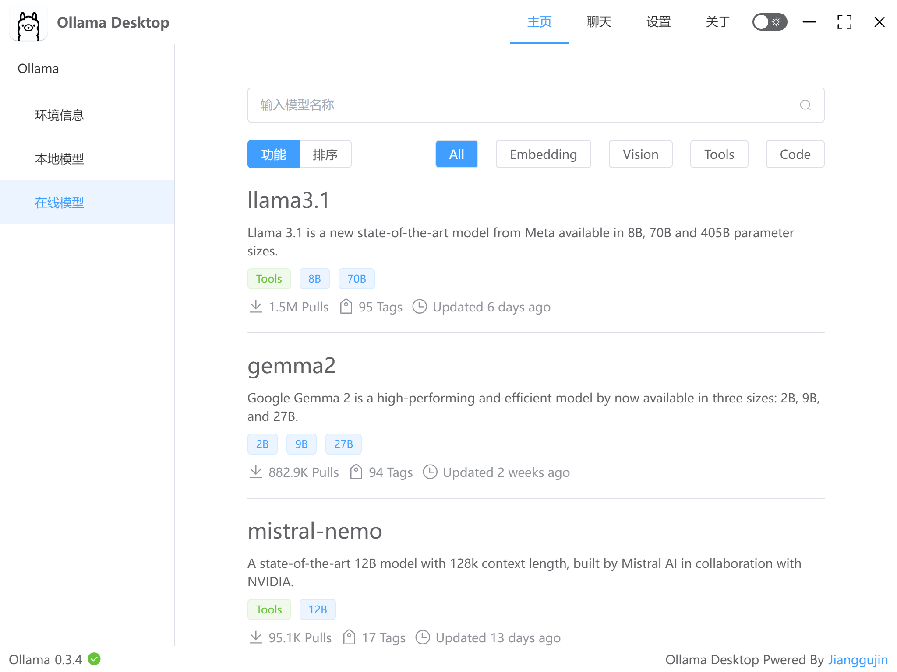
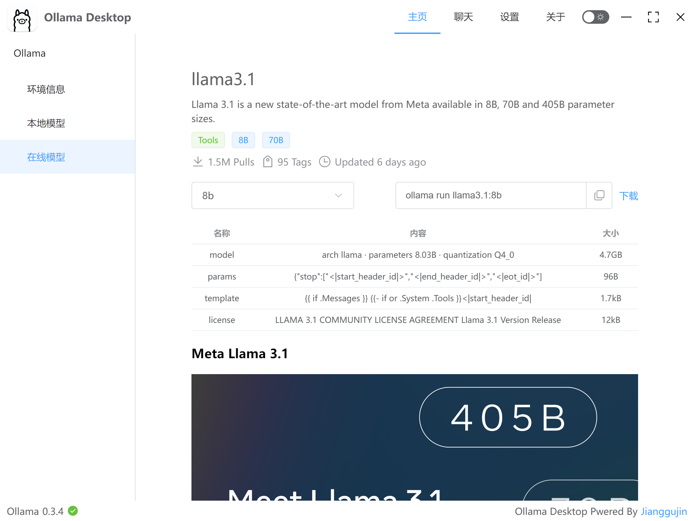
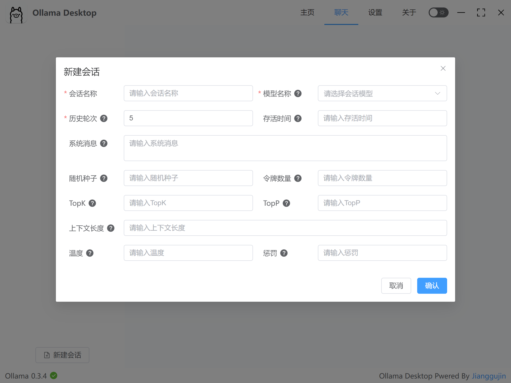
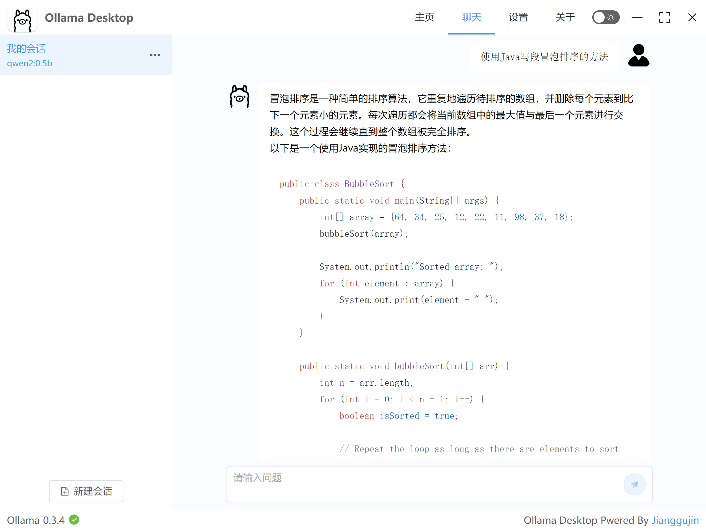
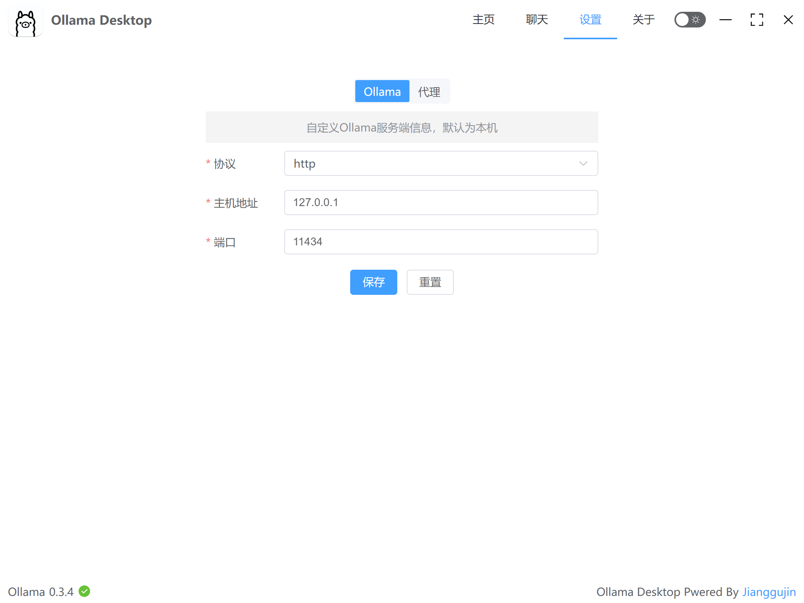
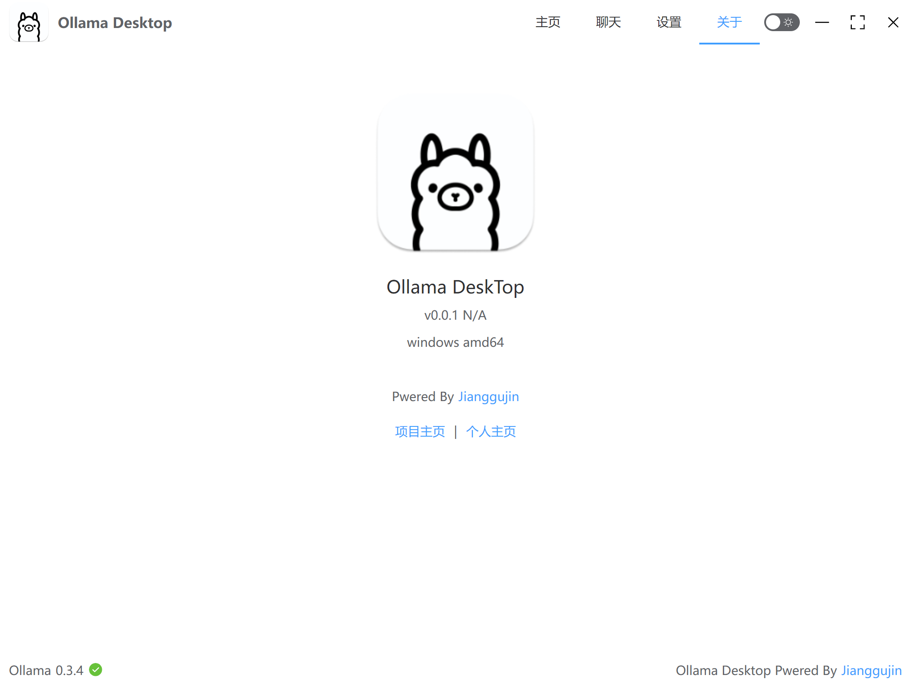

<h1 align="center" style="border-bottom: none;">Ollama Desktop</h1>

# 一、简介

  
  
  
  
  
  

Ollama Desktop是基于Ollama引擎的一个桌面应用解决方案，用于在macOS、Windows和Linux操作系统上运行和管理Ollama模型的GUI工具。

Ollama Desktop提供了丰富的功能，包括但不限于：

1. **可视化的管理界面**：用户可以通过图形界面轻松地管理Ollama模型，无需记忆命令行语法。
2. **在线模型**：用户可以直接查询Ollama支持的模型，通过界面直接下载。
3. **与模型对话**：Ollama Desktop提供了友好的可视化聊天界面，支持用户自定义会话模型、历史轮次、温度、惩罚等常用配置。
4. **部署简单**：相较于其他支持Ollama的可视化工具，Ollama Desktop提供了单一程序，无需复杂安装，开箱即用。

# 二、功能预览

## 2.1 主页

### 2.1. 1 环境信息

  

    
  

### 2.1.2 本地模型

  

    
  

### 2.1.3 在线模型

  

    
    
  

## 2.2 聊天

  

    
    
  

## 2.3 设置

  

    
  

## 2.4 关于

  

    
  

## 2.5 暗黑模式

  

    
  

# 三、帮忙点个⭐Star

开源不易，如果觉得Ollama Desktop对您有帮助的话，请帮忙在
的右上角点个⭐Star，您的支持是使Ollama Desktop变得更好最大的动力。

